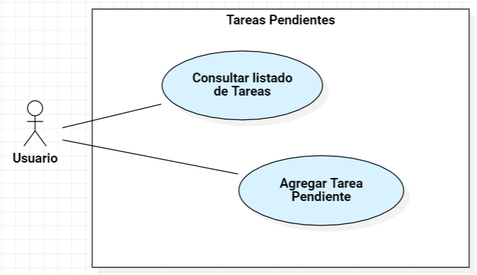
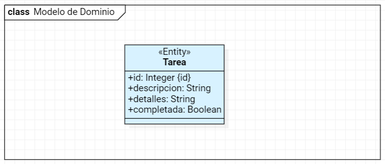

# Proyecto a realizar

En este tutorial construiremos una pequeña aplicación web para administrar tareas pendientes ("ToDo List").

## Casos de uso

La aplicación tiene unos pocos casos de uso:

| Caso de Uso                 | Descripción |
|-----------------------------|-------------|
| Consultar listado de Tareas | para revisar todas las tareas pendientes y completadas |
| Agregar Tarea Pendiente     | para agregar una nueva tarea                         |

## Modelo de dominio / entidades de negocio

El modelo de dominio consiste en una sola clase:

| Clase    | Descripción                                  |
|----------|----------------------------------------------|
| `Tarea`  | Tarea que está pendiente o que ya se realizó |

