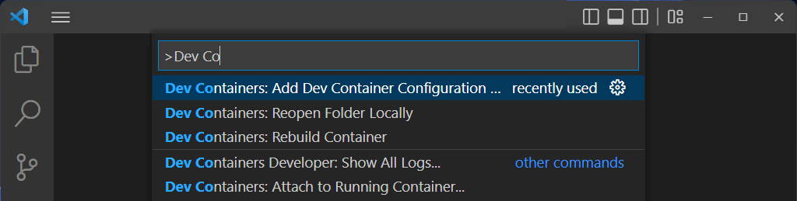
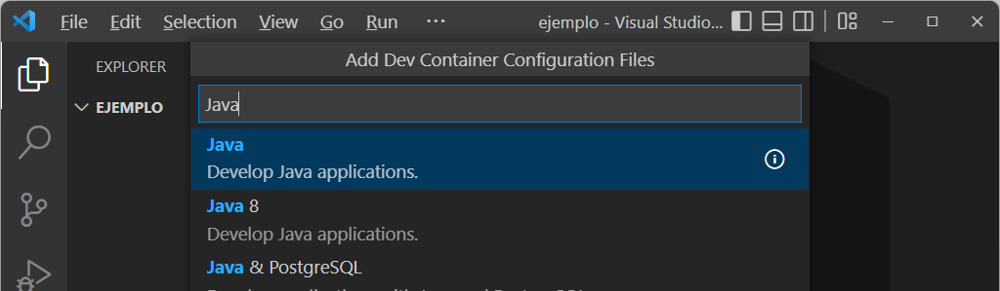

# Crear Ambiente de desarrollo

En Visual Studio Code, Github Codespaces y Gitpod es posible definir un ambiente de desarrollo para el proyecto, basado en contenedores, que será consistente para todos los desarrolladores del proyecto.

Hoy en día se pueden definir [Dev Containers](https://containers.dev/) en [Visual Studio Code](https://code.visualstudio.com/docs/devcontainers/containers) y [Github Codespaces](https://docs.github.com/en/codespaces/setting-up-your-project-for-codespaces/introduction-to-dev-containers).

- [Objetivo](#objetivo)
- [Crear un dev-container](#crear-un-dev-container)

## Objetivo

En este paso crearemos un Dev Container para desarrollar aplicaciones Java con Spring Boot. 
En este contenedor incluiremos Java 17, Maven, Docker y Git. 

> **NOTA:** En lugar de crear una imagen de Docker diferente para cada proyecto, se recomienda crear una imagen contenedor común. Para hacerlo, el sitio de Microsoft tiene una [guía para crear imágenes para varios proyectos](https://code.visualstudio.com/docs/devcontainers/devcontainer-cli#_prebuilding). 

---

## Crear un dev-container

1. (Si no lo ha hecho) Instale [Docker Desktop](https://www.docker.com/products/docker-desktop).

2. (Si no lo ha hecho) En Visual Studio Code, instale el complemento [`Remote Development Pack`](https://marketplace.visualstudio.com/items?itemName=ms-vscode-remote.vscode-remote-extensionpack&wt.mc_id=vscode-medium-brborges) en Visual Studio Code.

3. En Visual Studio Code, presione `[F1]` para que aparezca el menú de opciones y ejecute `Dev Containers: Add Dev Container Configuration Files...`

    

4. Seleccione el tipo de Dev Container como `Java`

    

5. Configure el software adicional y las opciones del Dev Container seleccionando
    - Versión de Java: `17` si usa computadores con procesadores Intel ó `17-bullseye` si usa computadores con procesadores ARM o Apple M1/M2.
    - Versión de Node.js: `lts/*`
    - Sistema de construcción: `Install Maven`
    - Características adicionales: 
      - `Azure CLI`
      - `Docker (Moby) support, reuse host Docker Engine (Docker-from-Docker)`
      - `Git (may require compilation)`
      - `Github CLI`
    - Versión de Docker/Moby: `20.10`
    - Versión de Git: `os-provided`

    Al terminar de ingresar las opciones, Visual Studio Code debe generar los archivos de configuración.

5. Presione `[F1]` y ejecute `Dev Containers: Reopen in Container` para iniciar el desarrollo en el Dev Container.

