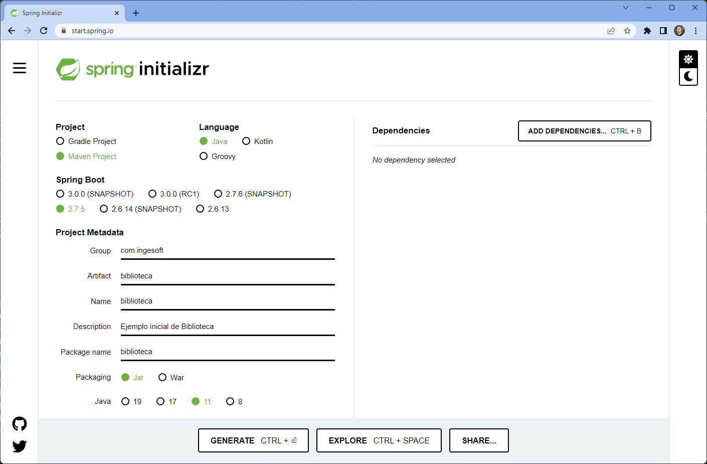
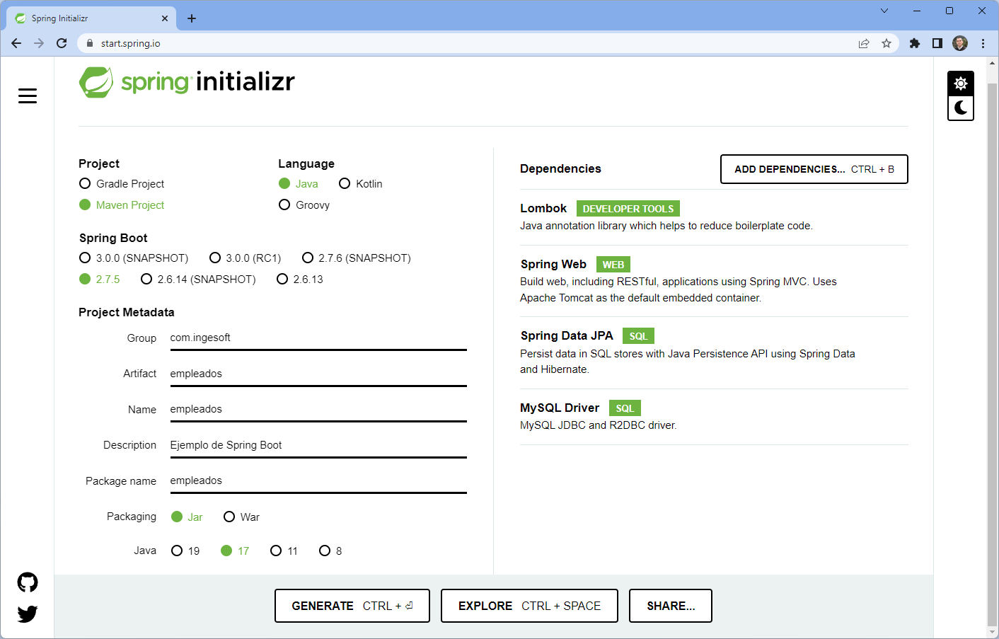
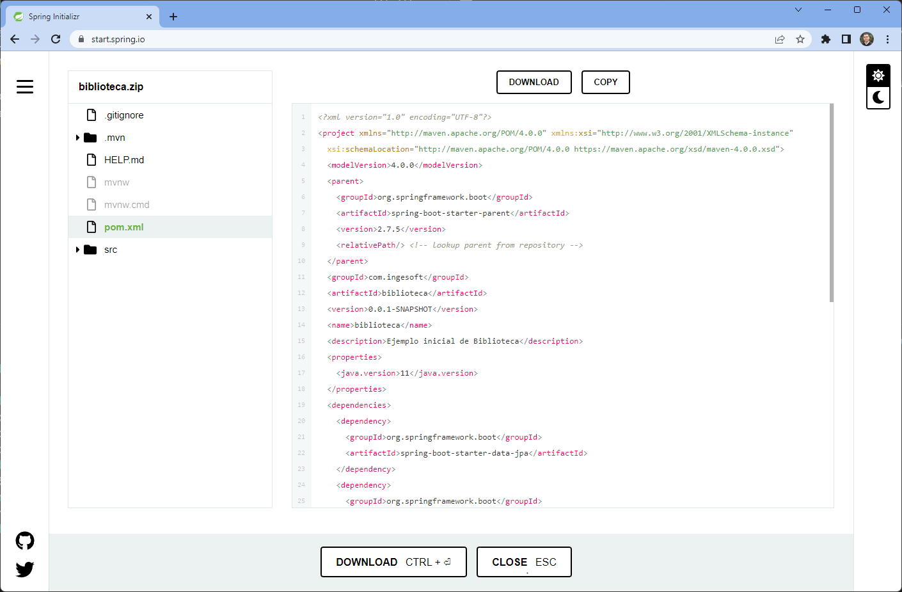

# Crear proyecto con Spring Boot

Los proyectos de Spring Boot se pueden crear usando la herramienta de Spring Boot Initializr

- [Objetivo](#objetivo)
- [Usando el sitio web](#usando-el-sitio-web)
- [Usando cURL](#usando-curl)
- [Usando Spring Boot CLI](#usando-spring-boot-cli)


---

## Objetivo

En este paso crearemos un proyecto inicial basado en Spring Boot. 
Este proyecto incluirá soporte para el desarrollo de aplicaciones web, usando [Lombok](https://projectlombok.org/) para construir el programa con menos líneas de código, [Spring Data JPA](https://spring.io/projects/spring-data-jpa) para crear repositorios de objetos usando JPA y [drivers JDBC de MySQL](https://www.mysql.com/products/connector/) para conectarnos a bases de datos MySQL.

---

## Usando el sitio web 

Es posible ir al [sitio web de Spring Initializr](https://start.spring.io/), configurar el proyecto y descargar el código fuente.

1. Ingrese las características del proyecto

    | Característica   | Valor a utilizar                |
    |------------------|---------------------------------|
    | Project          | `Maven Project`                 |
    | Language         | `Java`                          |
    | Spring Boot      | `2.7.5`                         |
    | Group            | `com.ingesoft`                  |
    | Artifact         | `tareas`                        |
    | Name             | `tareas`                        |
    | Descripcion      | `Ejemplo inicial de Tareas`     |
    | Package Name     | `tareas`                        |
    | Packaging        | `jar`                           |
    | Java             | `17`                            |

    

2. Seleccione las dependencias para la nueva aplicación

    | Dependencia      | Descripción                            |
    |------------------|----------------------------------------|
    | Lombok           | Anotaciones para escribir menos código |
    | Spring Web       | Aplicación web                         |
    | Spring Data JPA  | Persistencia basada en JPA             |
    | MySQL Driver     | Soporte para base de datos MySQL       |


    

3. (Opcionalmente) Haga clic en `Explore` para revisar los archivos que se van a generar para el proyecto.

    


4. Haga clic en `Generate` o `Download` para descargar un archivo `.zip` con el proyecto que acaba de inicializar.

5. Descomprima el archivo `.zip` para obtener los archivos recién generados.

---

## Usando cURL

Igualmente, es posible [usar la línea de comandos](https://docs.spring.io/initializr/docs/0.9.2/reference/html/#command-line) para generar y descargar el proyecto.

Por ejemplo, usando cURL

1. Determine los parámetros que va a utilizar para generar el proyecto:

    | Parámetro         | Valor                                 |
    |-------------------|---------------------------------------|
    | `type`            | `maven-project`                       |
    | `language`        | `java`                                |
    | `platformVersion` | `2.7.5`                               |
    | `packaging`       | `jar`                                 |
    | `jvmVersion`      | `11`                                  |
    | `groupId`         | `com.ingesoft`                        |
    | `artifactId`      | `tareas`                              |
    | `name`            | `tareas`                              |
    | `description`     | `Ejemplo%20inicial%20de%20Tareas`     |
    | `packageName`     | `tareas`                              |
    | `dependencies`    | `lombok,web,data-jpa,mysql`           |

    **NOTA:** Se puede usar el parámetro `baseDir` para definir el nombre del directorio que se desea usar para el proyecto. Si no define este parámetro, el código se creará en el mismo directorio actual.

2. Ejecute el comando `curl` con los parámetros apropiados. Use la dirección `https://start.spring.io/starter.zip` para descargar un archivo `.zip` o `https://start.spring.io/starter.tgz` para descargar un `.tgz`. Por ejemplo:

    ```
    curl https://start.spring.io/starter.zip \
        -d type=maven-project \
        -d language=java \
        -d platformVersion=2.7.5 \
        -d packaging=jar \
        -d jvmVersion=11 \
        -d groupId=com.ingesoft \
        -d artifactId=tareas \
        -d name=tareas \
        -d description=Ejemplo%20inicial%20de%20Tareas \
        -d packageName=tareas \
        -d dependencies=lombok,web,data-jpa,mysql \
        -o proyecto.zip        
    ```

    **NOTA:** En Linux es posible escribir un comando en varios renglones terminando cada línea con `\`. En Windows, cmd.exe o Powershell, debe terminar cada línea con `^`.

3. Descomprima el archivo `proyecto.zip` para trabajar con los archivos recién generados.

    **NOTA:** Se puede descargar y descomprmir el archivo en una sola línea enlazando los dos comandos. Por ejemplo,

    ```
    curl https://start.spring.io/starter.tgz \
        -d type=maven-project \
        -d language=java \
        -d platformVersion=2.7.5 \
        -d packaging=jar \
        -d jvmVersion=11 \
        -d groupId=com.ingesoft \
        -d artifactId=tareas \
        -d name=tareas \
        -d description=Ejemplo%20inicial%20de%20Tareas \
        -d packageName=tareas \
        -d dependencies=lombok,web,data-jpa,mysql \
        | tar -xzvf -
    ```

---

## Usando Spring Boot CLI

Spring ofrece además una utilidad de línea de comandos [Spring Boot CLI](https://docs.spring.io/spring-boot/docs/2.3.4.RELEASE/reference/htmlsingle/#cli-init) que permite inicializar el proyecto.

1. (Si no lo ha hecho) Instale los paquetes [`SDKMAN`](https://sdkman.io/install) y `Spring Boot CLI`

    ```
    # Instale SDKMAN 
    curl -s "https://get.sdkman.io" | bash
    source "$HOME/.sdkman/bin/sdkman-init.sh"

    # Use SDKMAN para instalar Spring Boot CLI
    sdk install springboot
    ```

2. Ejecute `spring init --list` para las diferentes alternativas para inicializar el proyecto.

    ```
    spring init --list
    ```

3. Determine los parámetros que desea usar para el proyecto. Por ejemplo

    | Parámetro           | Valor                             |
    |---------------------|-----------------------------------|
    | `--type`            | `maven-project`                   |
    | `--language`        | `java`                            |
    | `--bootVersion`     | `2.7.5`                           |
    | `--packaging`       | `jar`                             |
    | `--javaVersion`     | `11`                              |
    | `--groupId`         | `com.ingesoft`                    |
    | `--artifactId`      | `tareas`                          |
    | `--name`            | `tareas`                          |
    | `--description`     | `"Ejemplo inicial de Tareas"`     |
    | `--packageName`     | `tareas`                          |
    | `--dependencies`    | `lombok,web,data-jpa,mysql`       |


4. Ejecute el comando `spring init <parametros> <nombre.zip>` con los parámetros seleccionados

    ```
    spring init \
        --type=maven-project \
        --language=java \
        --bootVersion=2.7.5 \
        --packaging=jar \
        --javaVersion=11 \
        --groupId=com.ingesoft \
        --artifactId=tareas \
        --name=tareas \
        --description="Ejemplo inicial de Tareas" \
        --packageName=tareas \
        --dependencies=lombok,web,data-jpa,mysql \
        proyecto.zip
    ```

5. Descomprima el archivo `proyecto.zip` para trabajar con los archivos generados

