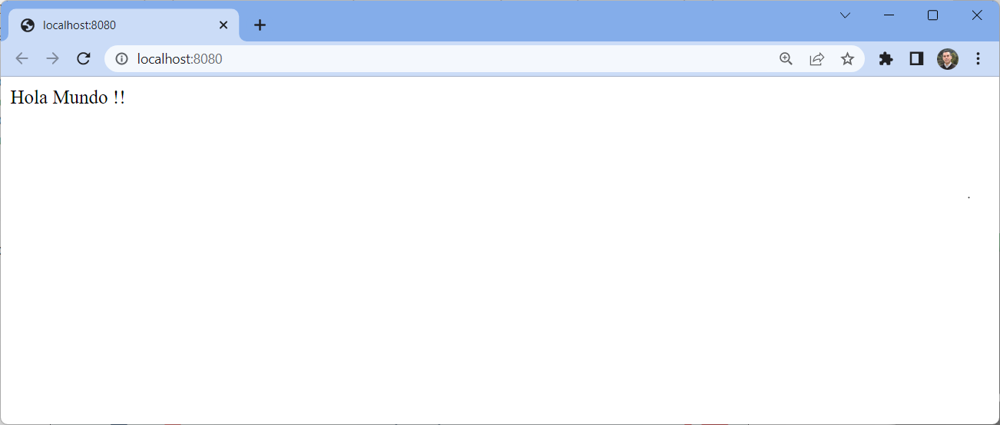

# Ejecutar el proyecto por primera vez

Como el proyecto se creó con la dependencia a Spring Data JPA, el programa intenta conectarse a una base de datos apenas inicia la ejecución. Para poder ejecutar el proyecto, es necesario configurar la base de datos y garantizar que se puede conectar sin problemas.

**NOTA:** Para continuar con el tutorial debe mantener MySQL en ejecución. Si detuvo el servidor, ejecute `docker compose up` de nuevo para iniciar MySQL otra vez.


- [Objetivo](#objetivo)
- [Configurando la conexión a la base de datos](#configurando-la-conexión-a-la-base-de-datos)
- [Ejecute la aplicación web](#ejecute-la-aplicación-web)


## Objetivo

En este paso  creará un archivo de configuración para la aplicación y construirá una imagen con el proyecto Spring Boot de forma que se pueda incluir en el mismo Docker Compose del servidor de base de datos.

---
## Configurando la conexión a la base de datos

La configuración de la aplicación se puede modificar en el archivo `application.properties`

1. Edite el archivo en `src/main/resources/application.properties` y agregue la configuración de la conexión a la base de datos. Use como URL de conexión a la base de datos `jdbc:mysql://localhost:3306` para usar el MySQL en el contenedor.

    ```
    logging.level.org.hibernate.SQL=DEBUG

    spring.datasource.url=jdbc:mysql://localhost:3306/tareas?serverTimezone=UTC
    spring.datasource.username=tareas
    spring.datasource.password=secret

    spring.jpa.show-sql=true
    spring.jpa.hibernate.ddl-auto=create-drop
    ```

## Ejecute la aplicación web

2. Cree un paquete `tareas.control`, y en ese paquete, cree una clase `HolaMundo` para agregar un punto de acceso web que nos permita ver que el programa está funcionando apropiadamente.

    ```
    package tareas.control;

    import org.springframework.web.bind.annotation.GetMapping;
    import org.springframework.web.bind.annotation.RestController;

    @RestController
    public class HolaMundo {
    
        @GetMapping("/")
        public String getMessage()  {
            return "Hola Mundo !!";
        }

    }
    ```

3. Ejecute `mvn spring-boot:run` para correr el programa que acaba de crear. Debería funcionar sin problemas.

    ```
    mvn -DskipTests package spring-boot:run
    ```

4. Al ejecutar el programa, la aplicación web se ejecuta en el puerto `8080`. Use el entorno de desarrollo para exponer el puerto y poder ver el resultado en un navegador web.

5. Usando un navegador web, revise el resultado en `http://localhost:8080`

6. Para terminar la ejecución, presione ``[Ctrl]+[C]` en la terminal donde se ejecutó `mvn spring-boot:run`.

    