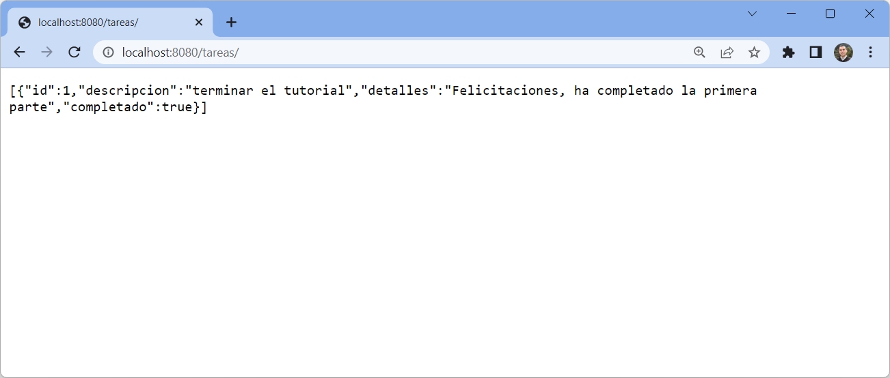

# Crear el servicio REST

Los servicios REST son servicios que procesan solicitudes HTTP, como las peticiones GET y POST, para gestionar los datos de la aplicación.

- [Objetivo](#objetivo)
- [Creando el repositorio y el servicio](#creando-el-repositorio-y-el-servicio)

---

## Objetivo

En este paso creará una clase `TareasRepository` para gestionar la entidad `Tarea`, y un servicio `TareasController` que procesará las peticiones HTTP del servicio REST 


## Creando el repositorio y el servicio

1. Cree, en el paquete `tareas.repository`, una interfaz `TareasRepository` que extienda `JpaRepository` con los parámetros `Tarea`, que la entidad de almacena, e `Long` que es el tipo de la llave primaria. Anote la clase con la anotación `@Repository`. 

    ```
    import tareas.model.Tarea;

    @Repository
    public interface TareasRepository extends JpaRepository<Tarea, Long> {
        
    }
    ```

2. En el paquete `tareas.control`, cree una clase `TareasController`.

    ```
    package tareas.control;

    import org.springframework.http.HttpStatus;

    import org.springframework.web.bind.annotation.*;

    import tareas.model.Tarea;
    import tareas.repository.TareasRepository;

    @RestController
    @RequestMapping("/")
    public class TareasController {
        
        private final TareasRepository tareasRepository;

        public TareasController(TareasRepository tareasRepository) {
            this.tareasRepository = tareasRepository;
        } 

        @PostMapping("/")
        @ResponseStatus(HttpStatus.CREATED)
        public Tarea crearTarea(@RequestBody Tarea todo) {
            return tareasRepository.save(todo);
        }

        @GetMapping("/")
        public Iterable<Tarea> getTareas() {
            return tareasRepository.findAll();
        }
    }
    ```

3. Modifique el controlador en la clase `HolaMundo`. Modifique el Mapping para que no sea `"/"` ya que es el mismo que estamos usando para tareas

    ```
    package tareas.control;

    import org.springframework.web.bind.annotation.GetMapping;
    import org.springframework.web.bind.annotation.RestController;

    @RestController
    public class HolaMundo {

        @GetMapping("/hola")
        public String getMessage()  {
            return "Hola Mundo !!";
        }

    }
    ```
4. Ejecute el proyecto

    ```
    mvn -DskipTests clean package spring-boot:run
    ```

5. Ejecute `curl` para insertar datos usando el servicio que acaba de crear en `http://127.0.0.1:8080/tareas/`. 

    Ejecute el siguiente comando para realizar una prueba. 

    ```
    curl --header "Content-Type: application/json" \
        --request POST \
        --data '{"descripcion":"terminar el tutorial","detalles":"Felicitaciones, ha completado la primera parte", "completado": "true"}' \
        http://127.0.0.1:8080/tareas/    
    ```

    El comando debe retornar el objeto creado en la base de datos

    ```
    {"id":1,"descripcion":"terminar el tutorial","detalles":"Felicitaciones, ha completado la primera parte","completado":true}
    ```

6. Consulte el listado de tareas, para osbervar que se han insertado los datos apropiadamente.

    Ejecute `curl` para obtener el listado de tareas

    ```
    curl http://127.0.0.1:8080/tareas/
    ```

    El comando debe retornar el listado de tareas en formato JSON

    ```
    [{"id":1,"descripcion":"terminar el tutorial","detalles":"Felicitaciones, ha completado la primera parte","completado":true}]    
    ```

    Igualmente, se puede ver el listado de tareas revisarndo el sitio web en `http://localhost:8080/tareas/`

     
    

7. Para detener la aplicación basta con ir a la terminal donde se está ejecutando `mvn spring-boot:run` y presionar `[Ctrl]+[C]`. 